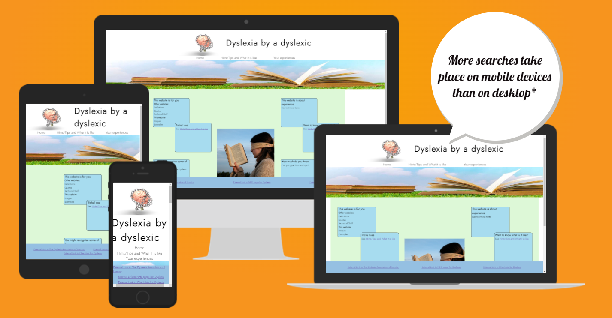
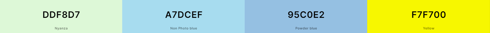
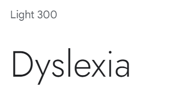

# Dyslexia by a dyslexic
Dyslexia by a dyslexic website is designed for two types of visitors. Firstly, make people with dyslexia feel that they are not alone in their experiences and have a simple safe space. Secondly allow non-dyslexics appreciate some of the differences of dyslexics.

The site can be access by this [link](https://rachwalm.github.io/dyslexia/index.html).

## User Experience (UX)
### Initial design
#### Scope and Strategy
There are lots of websites that provide technical information for dyslexics. These usually require a lot of reading, which is not advantageous for dyslexics and can be quite daunting. This website is going to use minimal text to provide an easy, calm and safe place for people wanting to find out more about dyslexia or feel that they are not alone/comment on their experiences.

It is out of scope of this project to provide any technical or medical advice. 

#### User Stories
First time user will use the site either as a potential dyslexic to discover more about if they are dyslexic and what they have in common with dyslexics or as a person interested in what being dyslexic is like. They will also be able to benefit from some ideas of how to work around dyslexic experiences.

Repeat and Frequent users will come back as a place to find other resources about dyslexia and as the hints and tips section expands learn more ways to do things easily.

#### Skeleton
- Landing page, to give user information on purpose of site
  - Header including logo, title and links to internal pages
  - Boxes to explain why this site exists, links to other parts of the site and a link to the checklist to find out if you have dyslexia
  - Footer, links to external resources
- Hints and Tips and what it is like
  - Header including logo, title and links to internal pages
  - Boxes to show different things experienced by dyslexics and tricks to get round them.
  - Video of moving text
  - Footer, links to external resources
- Form for people to share their experiences
  - Header including logo, title and links to internal pages
  - Form with Name and email contact and a text box to include personal experiences
  - Footer, links to external resources
#### Wireframes

- Wireframes were created on Balsamiq to show the basic layout of the website.
- There are wireframes for both desktop and mobile views.
- During development an additional intermediate size was developed for index and hints and tips page that contained the overlapping boxes of the desktop but the column layout of the mobile.

#### Colour Design

The colours for this project were decided by two factors:

 - Colours that are specifically easy (or hard) to read for dyslexics and generally accessible.
 - Colours that follow on from the pictures.

 This means that we were looking for blues and greens (and yellow).

 - Blue reduces the glare for dyslexics when placed as a background compared to whites and yellows. Blue was also present in both images as they both contained sky (which was another reason to select these images).
 - Green has strong associations with health and also follows on from the grass in the hero image.
 - Yellow is a very difficult color for some dyslexics to look at (including myself) due to a glare effect that non-dyslexics don't experience. So this is the colour that the box changes to to induce this effect in dyslexics.

 #### Font 

 The font also had to be chosen to be accessible to dyslexics. The straighter the lines in the font the easier it is to read for a dylexic. Therefore it had to be san-serif in nature as the serif adds to the complexity of the letters. Also avoiding letters that have curly lower case y's etc.

 Also only one font was used to reduce the complexity for the reader.

 Google font Jost weight 300 was used to cover these criteria.

 

## Maintenance
The external links to other resources need to be monitored to ensure that they are still leading to valid pages.

## Bugs

Initially boxes that contained the text in the main part of the pages index and hints and tips were positioned with relation to each other using 

Due to learning flex as I built the site there was a lot of positioning bugs that were fixed as I figured out how all the functions worked (or didn't do as I expected).

White line appeared under the hero image and before the background of the main text. Solution - hero image and area containing hero image were diffent sizes and needed to be synchronised.

White line at bottom of page

Form didn't need to be filled (although did request correct types to be filled in) so could submit an empty of part filled form. Solution - Mentor reminded me of the 'required' code when I mentioned it to her. 

Boxes in the main part of the page were hidden behind the footer. Solution

translate transform to absolute positioning and flex.

## Unsolved bugs

All bugs were solved

### Human errors

- Many spelling mistakes - all corrected (Hopefully).

- Missing or deleted closing tags - all corrected (Hopefully).

- Many attempts at code that needed mastery of the actions that it performed, like getting flex to put things where I wanted or appropriate sizing.

- Commit messages that could have followed best practise more completely.

## Deployment

The site was deployed to GitHub pages. It was deployed by the following actions:
- In the git hub repository *link* here, the settings tab was used.
- Pages was selected from the left hand side.
- Under Build and deployment Source section had 'Deploy from Branch' and the 'main' branch was selected.
- This selection was saved

Here is the [link](https://rachwalm.github.io/dyslexia/index.html) to the deployed page.

### Links
### Functions
### Responsiveness on different devices
### Other people using the site

## Resources used/Credits
### Technology used

- [HTML](https://developer.mozilla.org/en-US/docs/Web/HTML) was used for the basics of the site.
- [CSS](https://developer.mozilla.org/en-US/docs/Web/css) was added to generate the styles and layout of the site.
- [CSS Flexbox](https://developer.mozilla.org/en-US/docs/Learn/CSS/CSS_layout/Flexbox) was used to place objects in the desired location.
- [VSCode](https://code.visualstudio.com/) was used to create and edit the website.
- [Balsamiq](https://balsamiq.com/) was used to generate wireframes.
- [Git](https://git-scm.com/) was used for the version control through Git Commit.
- [GitHub](https://github.com/) was used to host the website.

https://www.resizepixel.com/
lots of code institute and W3 pages
you tube for video
 ## Attributation

 *,
*::before,
*::after {
  box-sizing: border-box;
  margin: 0;
  padding: 0;
}

This project is for educational purposes and not commercial gain, therefore the images and videos have been used within their expressed purpose.

Significant inspiration and learning for this project was from my mentor showing me things in her repository.

https://pxhere.com/en/photo/1041474
<a href="https://www.freepik.com/free-photo/open-book-grass_966471.htm#query=books&position=0&from_view=search&track=sph">Image by jannoon028</a> on Freepik
https://pixabay.com/illustrations/brain-chain-health-idea-human-3446307/ Image by <a href="https://pixabay.com/users/quincecreative-1031690/?utm_source=link-attribution&utm_medium=referral&utm_campaign=image&utm_content=3446307">3D Animation

utube video

https://www.dyslexialondon.org/
https://www.nhs.uk/conditions/dyslexia/
https://www.bdadyslexia.org.uk/dyslexia/how-is-dyslexia-diagnosed/dyslexia-checklists

google fonts

Icons if used

## Acknowledgements

Mentor
Tester team - My family
Code institute
Love running font awsome taken from love running that I did copying.

## Features
### Existing Features
Every page will have navigation to the other pages in the header and links to other external resources in the footer.
The landing page provides links to other pages to make it apparent what the site can be used for, explaining the purpose of the site. It also has a navigation bar in the top and links to internal pages in the main section to aid movement around the site.

The next page is a page for people to see what dyslexia is like and provides solutions to some common experiences. This page has video in the center that gives some idea of how difficult it is to read as a dyslexic.

There is also a box that changes color to give people some idea how blue can be a calming color to read against as opposed to glaring white or yellow. This part of the site is purposefully not a nice color or easy to read to show that this what dyslexics experience.

Form to submit

### Features Left to Implement

The form currently doesn't actually capture the data that is submitted or validate that the form has all the sections filled. These would be good next stage implementation.

Ideally the site would also contain more examples and hints and tips as the knowledge base was increased through user input. like curly text.

An additional page containing a form that counts up how many of the common things experienced by dyslexics you experience. So that people don't go to external sites for this information.

Error page that provides a 404 error with sites header and footer built in.

Consistent and more frequent commit messages that are in the correct format for future commits.

Youtube video to go back to the start not continue to other content.

## Testing

[def]: documents/all-size-website