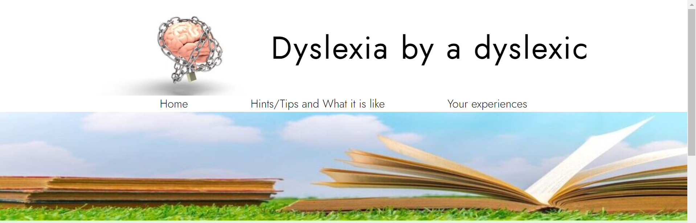
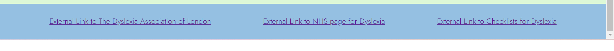
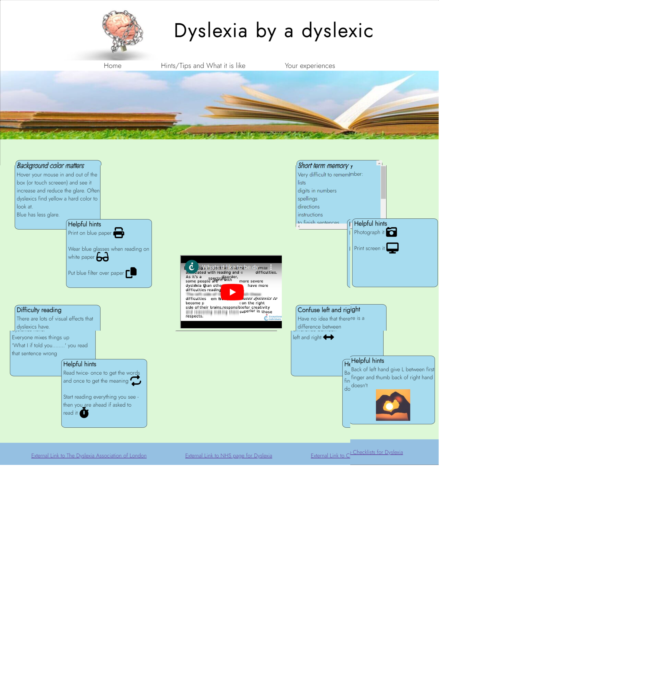
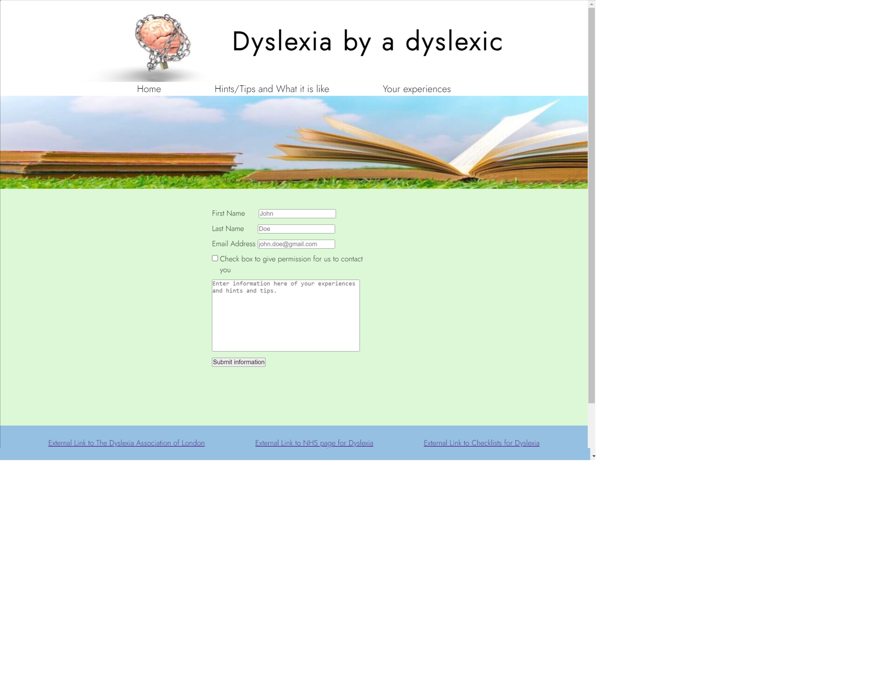
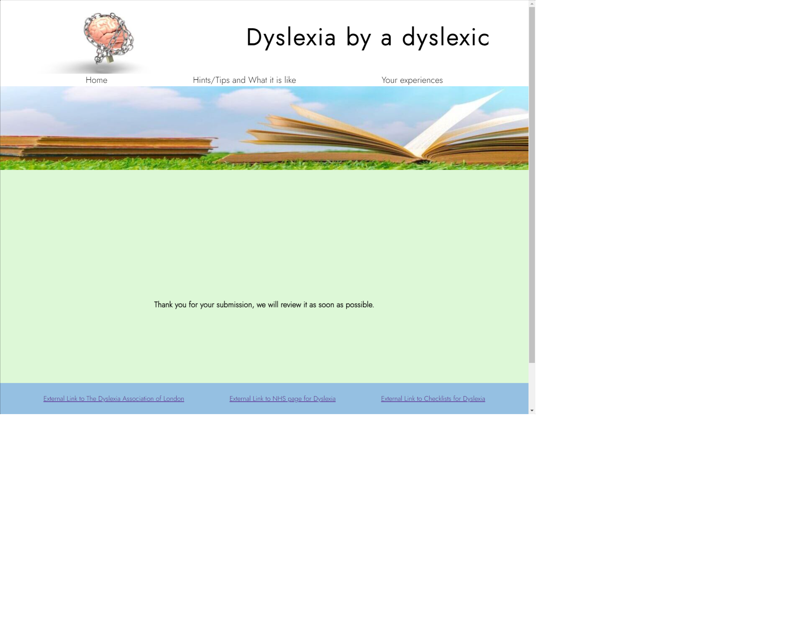

# Dyslexia by a dyslexic
Dyslexia by a dyslexic website is designed for two types of visitor experience. Firstly, make people with dyslexia feel that they are not alone in their experiences and have a simple safe space. Secondly, to allow non-dyslexics appreciate some of the differences experienced by dyslexics.

The site can be access by this [link](https://rachwalm.github.io/dyslexia/).

## User Experience (UX)
### Initial design
#### Scope and Strategy
There are many websites that provide technical information for dyslexics. These usually require a lot of reading, which is not advantageous for dyslexics and can be quite daunting. This website is going to use minimal text to provide an easy, calm and safe place for people wanting to find out more about dyslexia or feel that they are not alone/comment on their experiences.

It is out of scope of this project to provide any technical or medical advice. 

#### User Stories
First time user will use the site either as a potential dyslexic to discover more about whether they are dyslexic and what they have in common with dyslexics or as a person interested in what being dyslexic is like. They will also be able to benefit from some ideas of how to work around dyslexic experiences.

Repeat and Frequent users will come back as a place to find other resources about dyslexia and, as the hints and tips section expands, to learn more ways to do things easily.

#### Skeleton
- Landing page, to give user information on purpose of site
  - Header including logo, title and links to internal pages
  - Boxes to explain why this site exists, links to other parts of the site and a link to the checklist to find out if you have dyslexia
  - Footer, links to external resources
- Hints and Tips and what it is like
  - Header including logo, title and links to internal pages
  - Boxes to show different things experienced by dyslexics and tricks to get round them.
  - Video of moving text
  - Footer, links to external resources
- Form for people to share their experiences
  - Header including logo, title and links to internal pages
  - Form with Name and email contact and a text box to include personal experiences
  - Footer, links to external resources
#### Wireframes

Wireframes of the original design:

- [Desktop layout background for each page](documents/consistent-each-page-desktop.png)

- [Desktop layout index page](documents/index-desktop.png)

- [Desktop layout hints and tips page](documents/hints-tips-desktop.png)

- [Desktop layout form page](documents/form-desktop.png)

- [Desktop layout thank you page](documents/thank-you-desktop.png)

- [Mobile layout index page](documents/index-phone.png)

- [Mobile layout hints page](documents/hints-phone.png)

- [Mobile layout forms page](documents/form-phone.png)

- [Mobile layout thank you page](documents/thank-you-phone.png)

Wireframes were created on Balsamiq to show the basic layout of the website.

There are wireframes for both desktop and mobile views.

During development an additional intermediate size was developed for index and hints and tips page that contained the overlapping boxes of the desktop but the column layout of the mobile.

During development it was also decided that it was better to have the nav under the title so this was changed.

Development also led to the decision to exclude the box on the hints and tips page that said more were coming soon as the form wouldn't be generating information at this stage. The picture on the thank you page was also no longer required when it was only up for 10 seconds as it distracted from the message.

#### Colour Design

The colours for this project were decided by two factors:

 - Colours that are specifically easy (or hard) to read for dyslexics and generally accessible.
 - Colours that follow on from the pictures.

 This means that we were looking for blues and greens (and yellow).

 - Blue reduces the glare for dyslexics when placed as a background compared to whites and yellows. Blue was also present in both images as they both contained sky (which was another reason to select these images).
 - Green has strong associations with health and also follows on from the grass in the hero image.
 - Yellow is a very difficult color for some dyslexics to look at (including myself) due to a glare effect that non-dyslexics don't experience. So this is the colour that the box becomes to induce this effect in dyslexics.

 #### Font 

 The font also had to be chosen to be accessible to dyslexics. The straighter the lines in the font the easier it is to read for a dyslexic. Therefore it had to be san-serif in nature as the serif adds to the complexity of the letters. Also avoiding letters that have curly lower case y's etc.

 Also only one font was used to reduce the complexity for the reader.

 Google font Jost weight 300 was used to match these criteria. The only problem with this font is that the shape of the "c" although following dyslexia criteria does look like it has been cut off in the title rather than that is the shape it is meant to be.

 

## Features
### Existing Features
Every page has the logo, title and hero books on grass image to introduce the user to the website. 

There is navigation to the other pages in the header and links to other external resources in the footer. This allows the user to find the resources they want easily.

Header

Footer

The landing page explains the purpose of the site and provides boxes explaining the areas that might be of interest to the user. Links to other pages on the site to make it apparent what the site can be used for. It has a navigation bar in the top and links to internal pages in the main section to aid movement around the site.

The next page is a page for people to see what dyslexia is like and provides solutions to some common experiences. 

The hints page has video in the center that gives some idea of how difficult it is to read as a dyslexic. This should be useful visual for the user to understand dyslexia easily.

There is also a box that changes color to give people some idea how blue can be a calming color to read against as opposed to glaring white or yellow. The color change to yellow on this part of the site is purposefully not a nice/easy to read color to show that this glare is what dyslexics experience.

There is a box that contains a list that you can scroll through to point out that dyslexia makes short term memory difficult. This will allow the user to empathise with any short term memory issues.

The remaining text on the page is descriptions or solutions with icons or images to help the user identify with the text.

The third page is a form to submit the user's hints and experiences. This page requires the user to enter their name and e-mail. It has a box to enable the user to give permission for contact to be made by the site. It has a text box to enable them to write about their experiences and tips. The submit button then takes the user to a thank you page. The user interaction is intended to make users feel included and to collect useful user feedback which can be incorporated to improve user experience (when in the future it stores the data).

The thank you page should be displayed for 10 seconds then return the user to the index page unless then have already clicked a link. This page allows the user to know that their form has been submitted.

### Features for further implementation

The form currently doesn't actually capture the data that is submitted or validate that the form has all the sections filled. These would be good next stage implementation.

Ideally the site would also contain more examples and hints and tips as the knowledge base was increased through user input, for example information about curly text.

An additional page containing a form that counts up how many of the common things experienced by dyslexics you experience. So that people don't go to external sites for this information.

Error page that provides a 404 error with sites header and footer built in.

Consistent and more frequent commit messages that are in the correct format for future commits.

Youtube video to go back to the start not continue to other content.

## Maintenance
The external links to other resources need to be monitored to ensure that they are still leading to valid pages.

## Bugs

### Development bugs

Initially boxes that contained the text in the main part of the pages index and hints and tips were positioned with relation to each other using the CSS function translate:transform(x,y). However, as this was less practical for responsiveness the solution was to use relative positions instead. 

Due to learning flex as I built the site there were many positioning bugs that were fixed as I figured out how functions worked (or didn't do as I expected). I therefore feel that it is unnecessary to detail all the learning process here.

Hero image didn't extend across the whole page on certain devices. Solution - use object-fit:cover to remedy this. 

White line appeared under the hero image and before the background of the main text. Solution - hero image and area containing hero image were different sizes and needed to be standardised. These are now both 200px.
    
    #hero-outer {
     height:200px;
     object-fit: cover;
     width:100%;
    }

    #hero {
     height:200px;
     width:100%;
     overflow:hidden;
     object-fit:cover;
    }

White line at bottom of page, was fixed by using a margin function at the bottom of the main section so that the footer area covered the white line.

Boxes in the main part of the page were hidden behind the footer, both text boxes and the submit button on the form. The solution to this was also using a margin at the bottom of the main section. Useful information was gleaned from [MaterializeCSS](https://materializecss.com/footer.html).

    .fill-background {
    min-height:60vh;
    margin-bottom:4em;
    }

Originally the form didn't need to be filled (although it did request correct types to be filled in) so it was possible to submit an empty or part filled form. Solution - in response to mentioning this problem, my mentor reminded me of the HTML 'required' code in form items that need to be filled. 

When my mentor tried the website on her system it was not centering. As I had developed it on my screens and using the chrome developer tools that did not use 1920 x 1080 px size in the standard ones set I couldn't see this the first time it was mentioned. But once I realised the screen size difference and put that specific size into the chrome developer tools I could understand the problem and used the code she discussed to correct it.

    body {
    font-family: Jost, sans-serif;
    display: flex;
    align-items: center;
    width: 100%;
    flex-direction: column;
    background-color: #DDF8D7;
    width: 100%;
    }

    .column {
     display:flex;
     justify-content: space-around;
     padding: 25px;
     width:100%;
     max-width:85rem;
    }

It was realised that the color change for the hover function would not work on touch screen. Solution - to include text to ask user to touch the box instead of hover so that the functionality still worked. 

### Unsolved bugs

All detected bugs were solved

### Human errors

- Many spelling mistakes - all corrected (Hopefully).

- Missing or deleted closing tags - all corrected (Hopefully).

- Many attempts at code that needed mastery of the actions that it performed, like getting flex to put things in appropriate sizing or order. As this was also a learning exercise these positions were used to improve understanding of the function, so development went through phases that were not required for final product.

- Commit messages that could have followed best practice more completely.

## Deployment

### Deployment to Github

The site was deployed to GitHub pages. It was deployed by the following actions:
1. In the git hub [repository](https://github.com/RachWalm/dyslexia), the settings tab was used.
2. 'Pages' was selected from the left hand side.
3. Under Build and deployment Source section had 'Deploy from Branch' and the 'main' branch was selected.
4. This selection was saved.

Here is the [link](https://rachwalm.github.io/dyslexia/) to the deployed page.

### Local deployment

1. In the git hub [repository](https://github.com/RachWalm/dyslexia), clicked code button
2. clicked local
3. choose HTTPS
4. copied link
5. went to terminal (version control) and input the following :git clone https://github.com/RachWalm/dyslexia.git
6. the project was be cloned

## Resources used/Credits
### Technology used

- [HTML](https://developer.mozilla.org/en-US/docs/Web/HTML) was used for the basics of the site.
- [CSS](https://developer.mozilla.org/en-US/docs/Web/css) was added to generate the styles and layout of the site.
- [CSS Flexbox](https://developer.mozilla.org/en-US/docs/Learn/CSS/CSS_layout/Flexbox) was used to place objects in the desired location.
- [VSCode](https://code.visualstudio.com/) was used to create and edit the website.
- [Balsamiq](https://balsamiq.com/) was used to generate wireframes.
- [Git](https://git-scm.com/) was used for the version control through Git Commit.
- [GitHub](https://github.com/) was used to host the website.

### Images/video and image production

This project is for educational purposes and not commercial gain, therefore the images and videos have been used within their expressed purpose.

Sites for images:

- [Pixabay](https://pixabay.com/)
- [Pxhere](https://pxhere.com/)
- [Freepix](https://www.freepik.com/)

Images:

-  [link](https://pixabay.com/illustrations/brain-chain-health-idea-human-3446307/) to image by [3D Animation](https://pixabay.com/users/quincecreative-1031690/?utm_source=link-attribution&utm_medium=referral&utm_campaign=image&utm_content=3446307)

-  [Hero Image](https://www.freepik.com/free-photo/open-book-grass_966471.htm#query=books&position=0&from_view=search&track=sph)
by [jannoon028](https://www.freepik.com/free-photo/open-book-grass_966471.htm#query=books&position=0&from_view=search&track=sph) 

-   [link](https://pxhere.com/en/photo/1041474) to landing page center image of blindfolded girl reading - no attribution required

-  - [link](https://pxhere.com/en/photo/335) to image - no attribution required

To get the images cropped and to the correct size that was required the website used was [Resizepixel](https://www.resizepixel.com/)

Video was taken from youtube from [Video link](https://www.youtube.com/watch?v=y-OqesxoR1k)

The provided code from youtube for the share and embed function to have it start at 12 seconds after the introduction music was complete was adapted. 

The code that is supplied for this function is on youtube is:

    iframe width="560" height="315" src="https://www.youtube.com/embed/y-OqesxoR1k" title="YouTube video player" frameborder="0" allow="accelerometer; autoplay; clipboard-write; encrypted-media; gyroscope; picture-in-picture; web-share" allowfullscreen

It would be best to start at 12 seconds and not auto play etc. So this code was developed: 

    iframe width="560" height="215" src="https://www.youtube.com/embed/y-OqesxoR1k?start=12" title="What dyslexia is like from Youtube video"

## Web resources used

- [Chrome-DevTools](https://developer.chrome.com/docs/devtools/) were extremely useful for trying out different code without affecting my core code and particularly when working on responsiveness.

- [Lighthouse](https://developer.chrome.com/docs/lighthouse/overview/) was used to run the checks for performance and accessibility.

- [HTML-markdown-validator](https://validator.w3.org/) was used to validate the HTML.

- [CSS-validator](https://jigsaw.w3.org/css-validator/) was used to perform the CSS validation.

- The first image in the README.md was a screenshot from [AmIResponsive](https://amiresponsive.co.uk/).

- The pallet for the colors for the overall look of the website were generated using [coolors](https://coolors.co/)

- Icons were loaded from [font-awesome](https://fontawesome.com/).

- Responsive testing was performed using [Responsive viewer extension](https://chrome.google.com/webstore/detail/responsive-viewer/inmopeiepgfljkpkidclfgbgbmfcennb)

### External links

- External Link to [The Dyslexia Association of London](https://www.dyslexialondon.org/)

- External Link to [NHS page for Dyslexia](https://www.nhs.uk/conditions/dyslexia/)

- External Link to [Checklists for Dyslexia](https://www.bdadyslexia.org.uk/dyslexia/how-is-dyslexia-diagnosed/dyslexia-checklists)

 ## Attribution

The code at the start of the CSS file was discussed with my mentor as a necessary addition. This type of code was also used in Love running project in the code institute course work, it is to prevent default browser settings, to make the code compatible across browsers.

    *,
    *::before,
    *::after {
     box-sizing: border-box;
     margin: 0;
     padding: 0;
    }

We also discussed requirement for the 'meta' information in the HTML files. So this was based on the love running project from the code institute course content and on the discussions with my mentor. This is to allow search engines etc to suitably place the website according to it's content etc.

My flexbox was developed from three sources: 
- [W3](https://www.w3schools.com/css/css3_flexbox.asp)
- [Kevin Powell](https://www.youtube.com/watch?v=V9yP0QG0NWI&ab_channel=KevinPowell)
- [Flexboxfroggy](https://flexboxfroggy.com/)

I learnt a great deal about markdown and based the creation of the readme on the syntax discussed in [Markdown guide](https://www.markdownguide.org/basic-syntax) which was recommended by my mentor.

I also worked with my mentor on getting the image and background completely go across all screens with the 'object-fit:cover;' function. Which worked in combination with the overflow:hidden; to provide the hero image appropriately across the top of the screen irrespective of screen size.

My mentor did give me the code to send my thank you page back to the index in 10 seconds and I inserted the below code into the appropriate part of the page.

    <meta http-equiv="refresh" content="10; url=index.html">

I checked a lot of the code institute course material to remind myself of how to do certain things.

[W3](https://www.w3schools.com/html/default.asp) was of great use to me for checking the syntax of certain functions when I had errors (mostly spaces or typos).

The below was taken directly from the love running exercise in the code institute course work as this is the link to my kit.

    

All the links to the icons from font awesome were copied from the appropriate place for that icon on the [font-awesome](https://fontawesome.com/) website.

## Acknowledgements

My Mentor - Juliia Konn has been a superb support to me, giving me encouragement and a great deal of information.

My family - Pat Walmsley and Sarah Walmsley have tested the site on their personal devices and given very useful feedback.

My Partner - Ian Harris who has been extremely supportive while I have been working on this project.

Code institute - For all the information and course content that has contributed to the creation of this website. 

## Testing

For testing including validators and accessibility see [Testing](TESTING.md)