# Dyslexia by a dyslexic
Dyslexia by a dyslexic website is designed for two types of visitors. Firstly, make people with dyslexia feel that they are not alone in their experiences and have a simple safe space. Secondly allow non-dyslexics appreciate some of the differences of dyslexics.

The site can be access by this [link](https://rachwalm.github.io/dyslexia/index.html).

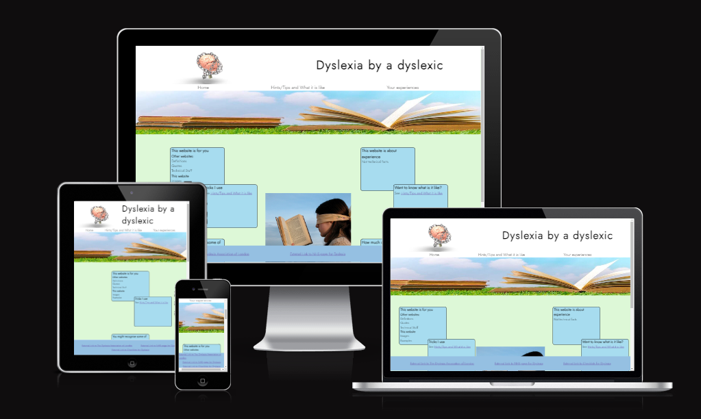

## User Experience (UX)
### Initial design
#### Scope and Strategy
There are lots of websites that provide technical information for dyslexics. These usually require a lot of reading, which is not advantageous for dyslexics and can be quite daunting. This website is going to use minimal text to provide an easy, calm and safe place for people wanting to find out more about dyslexia or feel that they are not alone/comment on their experiences.

It is out of scope of this project to provide any technical or medical advice. 

#### User Stories
First time user will use the site either as a potential dyslexic to discover more about if they are dyslexic and what they have in common with dyslexics or as a person interested in what being dyslexic is like. They will also be able to benefit from some ideas of how to work around dyslexic experiences.

Repeat and Frequent users will come back as a place to find other resources about dyslexia and as the hints and tips section expands learn more ways to do things easily.

#### Skeleton
- Landing page, to give user information on purpose of site
  - Header including logo, title and links to internal pages
  - Boxes to explain why this site exists, links to other parts of the site and a link to the checklist to find out if you have dyslexia
  - Footer, links to external resources
- Hints and Tips and what it is like
  - Header including logo, title and links to internal pages
  - Boxes to show different things experienced by dyslexics and tricks to get round them.
  - Video of moving text
  - Footer, links to external resources
- Form for people to share their experiences
  - Header including logo, title and links to internal pages
  - Form with Name and email contact and a text box to include personal experiences
  - Footer, links to external resources
#### Wireframes

Desktop layout background for each page

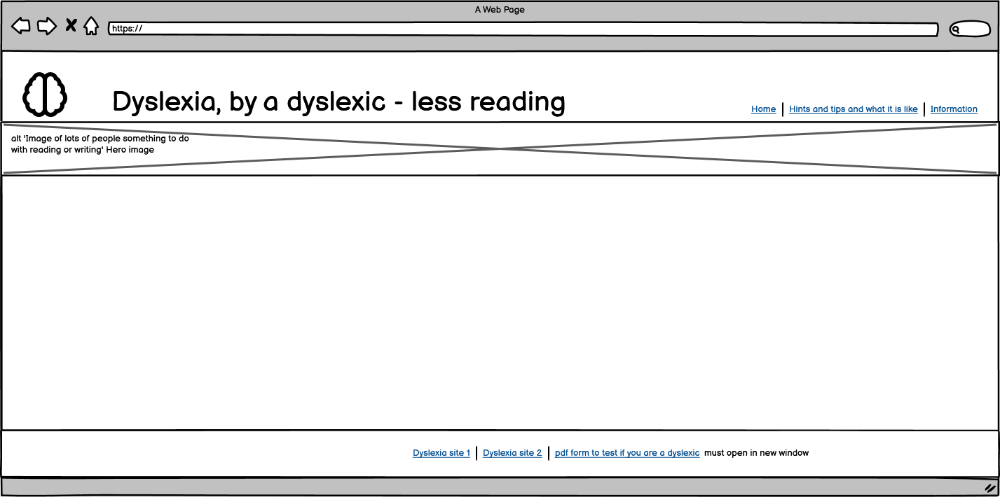

Desktop layout index page

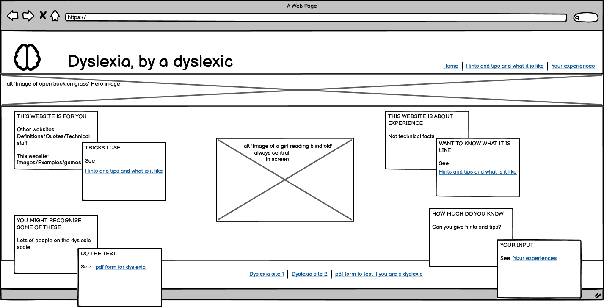

Desktop layout hints and tips page

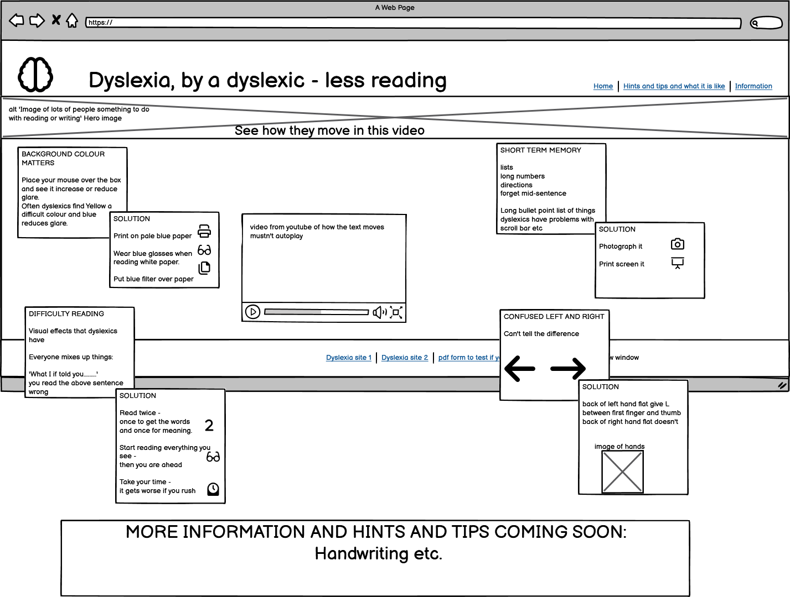

Desktop layout form page

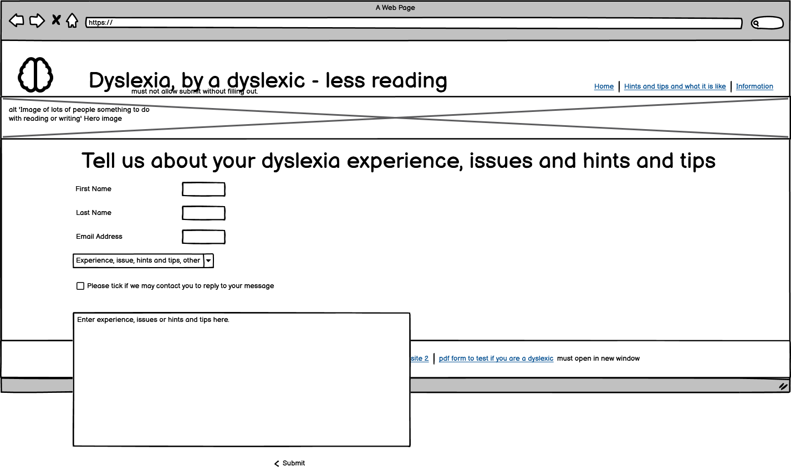

Desktop layout thank you page

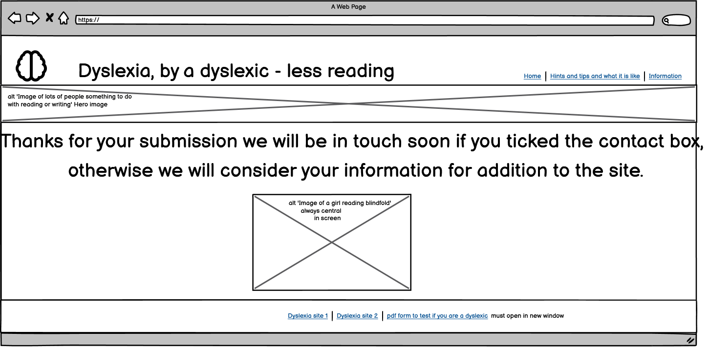

Mobile layout index page

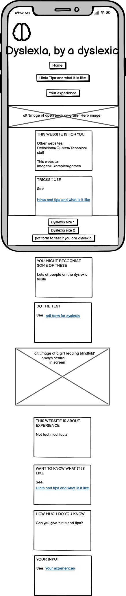

Mobile layout hints page

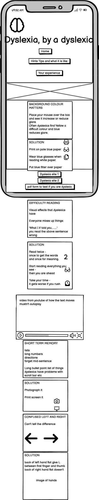

Mobile layout forms page

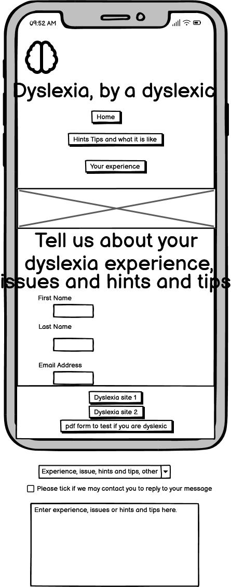
Mobile layout thank you page

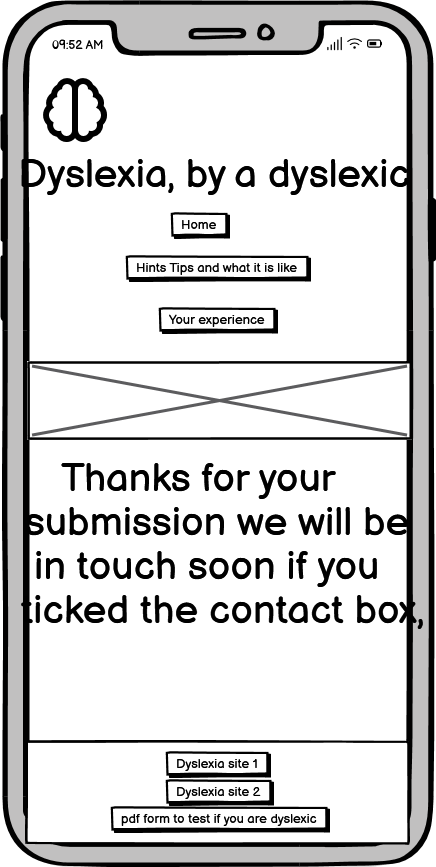

- Wireframes were created on Balsamiq to show the basic layout of the website.
- There are wireframes for both desktop and mobile views.
- During development an additional intermediate size was developed for index and hints and tips page that contained the overlapping boxes of the desktop but the column layout of the mobile.
- During development it was also decided that it was better to have the nav under the title so this was changed.
- Development also lead to the decision to not do the box on the hints and tips page that said more were coming soon as the form wouldn't be generating information at this stage. The picture on the thank you page was also no longer required when it was only up for 10 seconds as it distracted from the message.

#### Colour Design

The colours for this project were decided by two factors:

 - Colours that are specifically easy (or hard) to read for dyslexics and generally accessible.
 - Colours that follow on from the pictures.

 This means that we were looking for blues and greens (and yellow).

 - Blue reduces the glare for dyslexics when placed as a background compared to whites and yellows. Blue was also present in both images as they both contained sky (which was another reason to select these images).
 - Green has strong associations with health and also follows on from the grass in the hero image.
 - Yellow is a very difficult color for some dyslexics to look at (including myself) due to a glare effect that non-dyslexics don't experience. So this is the colour that the box changes to to induce this effect in dyslexics.

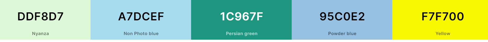

 #### Font 

 The font also had to be chosen to be accessible to dyslexics. The straighter the lines in the font the easier it is to read for a dylexic. Therefore it had to be san-serif in nature as the serif adds to the complexity of the letters. Also avoiding letters that have curly lower case y's etc.

 Also only one font was used to reduce the complexity for the reader.

 Google font Jost weight 300 was used to cover these criteria.

 

## Maintenance
The external links to other resources need to be monitored to ensure that they are still leading to valid pages.

## Bugs

### Development bugs

Initially boxes that contained the text in the main part of the pages index and hints and tips were positioned with relation to each other using the CSS function translate:transform(x,y). However, as this was less practical for responsiveness the soultions was to use relative positions instead. 

Due to learning flex as I built the site there was a lot of positioning bugs that were fixed as I figured out how all the functions worked (or didn't do as I expected). So I won't detail all the learning process here.

Hero image didn't extend across the whole page on certain devices. Solution - use object-fit:cover to ensure that 

White line appeared under the hero image and before the background of the main text. Solution - hero image and area containing hero image were diffent sizes and needed to be synchronised. These are now both 200px.
    
    #hero-outer {
     height:200px;
     object-fit: cover;
     width:100%;
    }

    #hero {
     height:200px;
     width:100%;
     overflow:hidden;
     object-fit:cover;
    }

White line at bottom of page, was fixed by using a margin function at the bottom of the main section so that the footer area covered the white line.

Boxes in the main part of the page were hidden behind the footer, both text boxes and the submit button on the form. The solution to this was also using a margin at the bottom of the main section.

    .fill-background {
    min-height:60vh;
    margin-bottom:4em;

Form didn't need to be filled (although did request correct types to be filled in) so could submit an empty of part filled form. Solution - Mentor reminded me of the HTML 'required' code in form items that need to be filled when I mentioned it to her that I still needed to do that. 

When my mentor tried the website on her system it was not centering. As I had developed it on my screens and using the chrome developer tools that did not use 1920 x 1080 px size in the standard ones set I couldn't see this the first time it was mentioned. But once I realised the screen size difference and put that specific size into the chrome developer tools I could understand the problem and used the code she discussed to correct it.

    body {
     font-family: Jost, sans-serif;
     display:flex;
     align-items:center;
     width:100%;
     flex-direction: column;
    }

    .column {
     display:flex;
     justify-content: space-around;
     padding: 25px;
     width:100%;
     max-width:85rem;
    }

This centered the code and put a white area down the sides on larger screens. As there is a white banner behind the title and logo so the colour didn't look out of place and it spaced unattractively if the screen was too large and entirely filled it with the current content. After trying a few options, it was decided the white columns down the side were acceptable vs the time to do serious redesign.

It was realised that the color change for the hover function would not work on touch screen. Solution - to include text to ask user to touch the box instead of hover so that the functionality still worked. 

### Unsolved bugs

All detected bugs were solved

### Human errors

- Many spelling mistakes - all corrected (Hopefully).

- Missing or deleted closing tags - all corrected (Hopefully).

- Many attempts at code that needed mastery of the actions that it performed, like getting flex to put things in appropriate sizing or order. As this was also a learning exercise these positions were used to greater understand the function, so went through phases that were not for final product.

- Commit messages that could have followed best practise more completely.

## Deployment

The site was deployed to GitHub pages. It was deployed by the following actions:
- In the git hub [repository](https://github.com/RachWalm/dyslexia), the settings tab was used.
- Pages was selected from the left hand side.
- Under Build and deployment Source section had 'Deploy from Branch' and the 'main' branch was selected.
- This selection was saved

Here is the [link](https://rachwalm.github.io/dyslexia/index.html) to the deployed page.

### Responsiveness on different devices

Devices sizes checked using developer tools chrome extension for responsive viewer.

Index page

[Galaxy-S9-Note-8-S8-360x740](documents/index-360x740.png)

[Galaxy-S9-Plus-S8-Plus-412x846](documents/index-412x846.png)

[iPad-Mini-768x1024](documents/index-768x1024.png)

[iPad-Pro-(12.9-inch)-1024x1366](documents/index-1024x800.png)

[iPhone-XR-XS-Max-414x896](documents/index-414x896.png)

[iPhone-XS-X-375x812](documents/index-375x812.png)

[Laptop-1-1440x900](documents/index-1440x900.png)

[Laptop-2-1280x800](documents/index-1280x800.png)

[Laptop-3-1280x950](documents/index-1280x950.png)

[Large-Screen-688x1031](documents/index-688x1031.png)

[Medium-Screen-1024x800](documents/index-1024x800.png)

[Pixel-3-3-XL-393x786](documents/index-393x786.png)

[Large-monitor-1920x1080](documents/index-1920x1080.png)

Hints and tips and what it is like page

[Galaxy-S9-Note-8-S8-360x740](documents/hints-360x740.png)

[Galaxy-S9-Plus-S8-Plus-412x846](documents/hints-412x846.png)

[iPad-Mini-768x1024](documents/hints-768x1024.png)

[iPad-Pro-(12.9-inch)-1024x1366](documents/hints-1024x1366.png)

[iPhone-XR-XS-Max-414x896](documents/hints-414x896.png)

[iPhone-XS-X-375x812](documents/hints-375x812.png)

[Laptop-1-1440x900](documents/hints-1440x900.png)

[Laptop-2-1280x800](documents/hints-1280x800.png)

[Laptop-3-1280x950](documents/hints-1280x950.png)

[Large-Screen-688x1031](documents/hints-688x1031.png)

[Medium-Screen-1024x800](documents/hints-1024x800.png)

[Pixel-3-3-XL-393x786](documents/hints-393x786.png)

[Large-monitor-1920x1080](documents/hints-1920x1080.png)

Form page

[Galaxy-S9-Note-8-S8-360x740](documents/form-360x740.png)

[Galaxy-S9-Plus-S8-Plus-412x846](documents/form-412x846.png)

[iPad-Mini-768x1024](documents/form-768x1024.png)

[iPad-Pro-(12.9-inch)-1024x1366](documents/form-1024x1366.png)

[iPhone-XR-XS-Max-414x896](documents/form-414x896.png)

[iPhone-XS-X-375x812](documents/form-375x812.png)

[Laptop-1-1440x900](documents/form-1440x900.png)

[Laptop-2-1280x800](documents/form-1280x800.png)

[Laptop-3-1280x950](documents/form-1280x950.png)

[Large-Screen-688x1031](documents/form-688x1031.png)

[Medium-Screen-1024x800](documents/form-1024x800.png)

[Pixel-3-3-XL-393x786](documents/form-393x786.png)

[Large-monitor-1920x1080](documents/form-1920x1080.png)

Thank you page

[Galaxy-S9-Note-8-S8-360x740](documents/thank-360x740.png)

[Galaxy-S9-Plus-S8-Plus-412x846](documents/thank-412x846.png)

[iPad-Mini-768x1024](documents/thank-768x1024.png)

[iPad-Pro-(12.9-inch)-1024x1366](documents/thank-1024x1366.png)

[iPhone-XR-XS-Max-414x896](documents/thank-414x896.png)

[iPhone-XS-X-375x812](documents/thank-375x812.png)

[Laptop-1-1440x900](documents/thank-1440x900.png)

[Laptop-2-1280x800](documents/thank-1280x800.png)

[Laptop-3-1280x950](documents/thank-1280x950.png)

[Large-Screen-688x1031](documents/thank-688x1031.png)

[Medium-Screen-1024x800](documents/thank-1024x800.png)

[Pixel-3-3-XL-393x786](documents/thank-393x786.png)

[Large-monitor-1920x1080](documents/thank-1920x1080.png)

## Resources used/Credits
### Technology used

- [HTML](https://developer.mozilla.org/en-US/docs/Web/HTML) was used for the basics of the site.
- [CSS](https://developer.mozilla.org/en-US/docs/Web/css) was added to generate the styles and layout of the site.
- [CSS Flexbox](https://developer.mozilla.org/en-US/docs/Learn/CSS/CSS_layout/Flexbox) was used to place objects in the desired location.
- [VSCode](https://code.visualstudio.com/) was used to create and edit the website.
- [Balsamiq](https://balsamiq.com/) was used to generate wireframes.
- [Git](https://git-scm.com/) was used for the version control through Git Commit.
- [GitHub](https://github.com/) was used to host the website.

https://www.resizepixel.com/
lots of code institute and W3 pages
you tube for video
 ## Attributation

 *,
*::before,
*::after {
  box-sizing: border-box;
  margin: 0;
  padding: 0;
}

This project is for educational purposes and not commercial gain, therefore the images and videos have been used within their expressed purpose.

Significant inspiration and learning for this project was from my mentor showing me things in her repository.

https://pxhere.com/en/photo/1041474
<a href="https://www.freepik.com/free-photo/open-book-grass_966471.htm#query=books&position=0&from_view=search&track=sph">Image by jannoon028</a> on Freepik
https://pixabay.com/illustrations/brain-chain-health-idea-human-3446307/ Image by <a href="https://pixabay.com/users/quincecreative-1031690/?utm_source=link-attribution&utm_medium=referral&utm_campaign=image&utm_content=3446307">3D Animation

utube video

https://www.dyslexialondon.org/
https://www.nhs.uk/conditions/dyslexia/
https://www.bdadyslexia.org.uk/dyslexia/how-is-dyslexia-diagnosed/dyslexia-checklists

google fonts

Icons if used

## Acknowledgements

My Mentor - Juliia Konn has been a superb support to me, giving me encouragement and a great deal of information for me to learn from.

My family - Pat Walmsley and Sarah Walmsley have tested the site on their personal devices and given very useful feedback.

My Partner - Ian Harris who has been extremely supportive while I have been working on this project.

Code institute - For all the information and learning that I have done that contributed to this website. 

Love running font awsome taken from love running that I did copying.

## Features
### Existing Features
Every page will have navigation to the other pages in the header and links to other external resources in the footer.
The landing page provides links to other pages to make it apparent what the site can be used for, explaining the purpose of the site. It also has a navigation bar in the top and links to internal pages in the main section to aid movement around the site.

The next page is a page for people to see what dyslexia is like and provides solutions to some common experiences. This page has video in the center that gives some idea of how difficult it is to read as a dyslexic.

There is also a box that changes color to give people some idea how blue can be a calming color to read against as opposed to glaring white or yellow. This part of the site is purposefully not a nice color or easy to read to show that this what dyslexics experience.

Form to submit

### Features Left to Implement

The form currently doesn't actually capture the data that is submitted or validate that the form has all the sections filled. These would be good next stage implementation.

Ideally the site would also contain more examples and hints and tips as the knowledge base was increased through user input. like curly text.

An additional page containing a form that counts up how many of the common things experienced by dyslexics you experience. So that people don't go to external sites for this information.

Error page that provides a 404 error with sites header and footer built in.

Consistent and more frequent commit messages that are in the correct format for future commits.

Youtube video to go back to the start not continue to other content.

### Links
### Functions