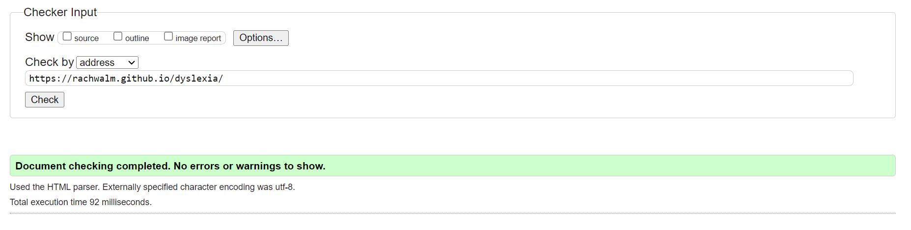
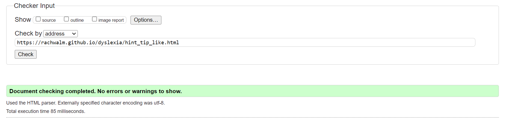
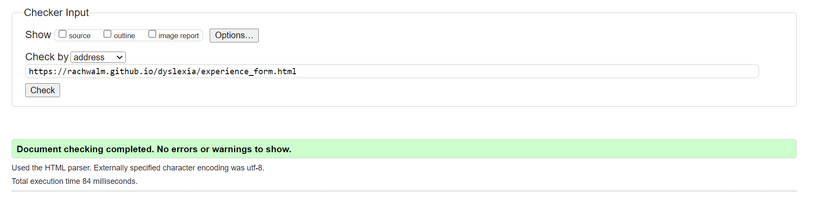
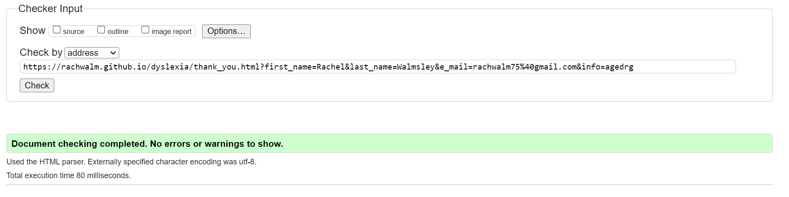
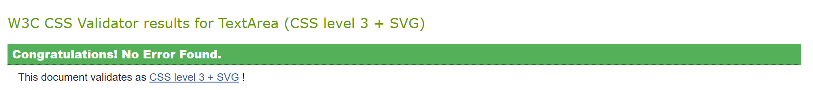
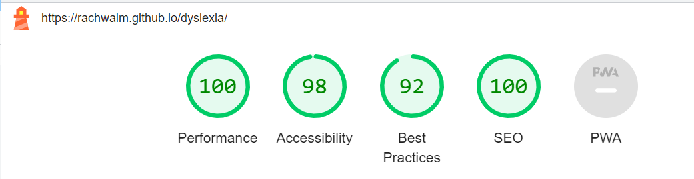
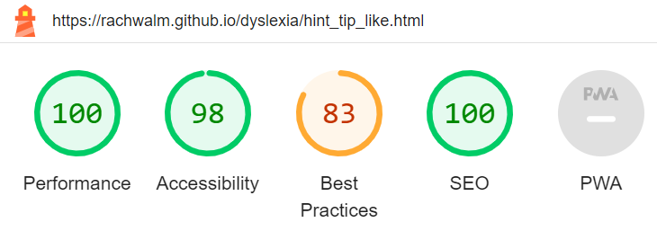
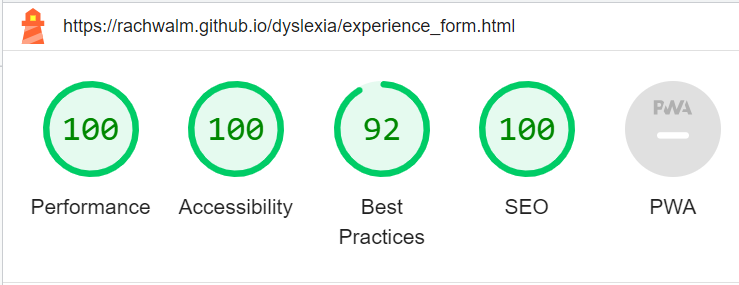
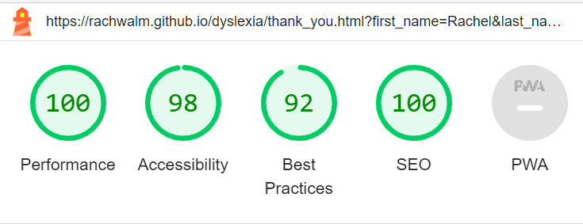

# Testing for "Dyslexia by a dyslexic"

## General testing

General testing was performed throughout development to ensure that the coding was behaving as anticipated. Bugs were fixed during development see Bugs section of README.md.

Responsiveness was tested using the Chrome extension Responsive Veiwer, the result of which is in README.md in the section responsiveness on different devices.

My family Pat Walmsley and Sarah Walmsley and my partner Ian Harris used the website as typical user level participants. Pat Walmsley used a laptop and the browser Chrome. Sarah Walmsley used an ipad with Safari and Ian Harris used a google app with a Galaxy S10.

Pat Walmsley suggested to alternative wording and text positioning and size changes, but no bugs reported.

Sarah Walmsley and Ian Harris did not report any bugs.

## Validators

HTML Validator

- Index

- Hints page

- Form page 

- Thank you page

CSS validator

## Accessiblity 

- Index

- Hints page

- Form page 

- Thank you page

## Functions testing.

Tested function on Chrome/Safari/Firefox following the table below:

|Function   |Browser |Page |Expected result| Pass? |Comments|
|-------|----------|---------|-----------|---------|-------|
|Load from url by typing url|Chrome|None |Index page loads|Pass | |
|Index page looks as intended visually|Chrome|Index|Index page looks as intended|Pass
|Nav bar|Chrome|Index||||
|Click "Home" nav link |Chrome|Index |Remains on Index screen|Pass
|Click "Hints/Tips and What it is like" nav link |Chrome|Index |Loads Hints and tips page|Pass
|Click "Your experiences" nav link|Chrome|Index | Loads form page|Pass
|Hover over "Home" nav link|Chrome|Index | Text enlargens |Pass
|Hover over "Hints/Tips and What it is like" nav link |Chrome|Index |Text enlargens |Pass
|Hover over "Your experiences" nav link|Chrome|Index |Text enlargens |Pass
|Main section|Chrome|Index|
|Click link in top left box |Chrome|Index|Loads Hints and tips page|Pass
|Click link in bottom left box |Chrome|Index |Loads external checklist page in new window|Pass
|Click link in top right box |Chrome|Index |Loads Hints and tips page|Pass
|Click link in bottom right box |Chrome|Index |Loads form page|Pass
|Footer|Chrome|Index|
|Click link in footer for dyslexia association |Chrome|Index |Loads dyslexia association website in new window|Pass
|Click link in footer for NHS |Chrome|Index |Loads NHS website in new window|Pass
|Click link in footer for checklist |Chrome|Index |Loads external checklist page in new window|Pass
|Hints page page looks as intended visually|Chrome|Hints page|Hints page page looks as intended|Pass
|Nav bar|Chrome|Hints page||||
|Click "Home" nav link |Chrome|Hints page |Loads index page|Pass
|Click "Hints/Tips and What it is like" nav link |Chrome|Hints page |Remains on hints page|Pass
|Click "Your experiences" nav link|Chrome|Hints page |Loads form page|Pass
|Hover over "Home" nav link|Chrome|Hints page |Text enlargens |Pass
|Hover over "Hints/Tips and What it is like" nav link |Chrome|Hints page |Text enlargens |Pass| 
|Hover over "Your experiences" nav link|Chrome|Hints page |Text enlargens |Pass
|Main section|Chrome|Hints page|
|Blue to Yellow color change| Chrome|Hints page|When hovered or tapped color changes correctly|Pass|Mouse hover and touch screen on laptop activates color change. Click elsewhere to return to blue
|Scroll works in top right box|Chrome|Hints page|Can scroll through list|Pass
|You tube video|Chrome|Hints page|Plays only on request as an embedded video|Pass|Didn't play automatically but did play when clicked
|Footer|Chrome|Hints page|
|Click link in footer for dyslexia association |Chrome|Hints page |Loads dyslexia association website in new window|Pass
|Click link in footer for NHS |Chrome|Hints page |Loads NHS website in new window|Pass
|Click link in footer for checklist |Chrome|Hints page |Loads external checklist page in new window|Pass
|Form page page looks as intended visually|Chrome|Form page|Form page page looks as intended|Pass
|Nav bar|Chrome|Form page||||
|Click "Home" nav link |Chrome|Form page |Loads index page|Pass
|Click "Hints/Tips and What it is like" nav link |Chrome|Form page |Loads Hints and tips page|Pass
|Click "Your experiences" nav link|Chrome|Form page |Remains on form page|Pass
|Hover over "Home" nav link|Chrome|Form page |Text enlargens |Pass
|Hover over "Hints/Tips and What it is like" nav link |Chrome|Form page |Text enlargens |Pass
|Hover over "Your experiences" nav link|Chrome|Form page |Text enlargens |Pass
|Main section|Chrome|Form page|
|First name input|Chrome |Form page| Takes name input and produces error if attempt to submit empty|Pass
|Last name input|Chrome |Form page| Takes name input and produces error if attempt to submit empty|Pass
|Email input|Chrome|Form page| Will only accept text of email format and produces error if attempt to submit empty|Pass|
|Contact permission box| Chrome|Form page|Can be empty or filled. Try both. |Pass| Will submit with the box filled or not
|Text area|Chrome|Form page|Text can be added and must be added or produces error|Pass
|Submit button|Chrome|Form page|If required sections are filled takes you to thank you page|Pass
|Footer|Chrome|Form page|
|Click link in footer for dyslexia association |Chrome|Form page |Loads dyslexia association website in new window|Pass
|Click link in footer for NHS |Chrome|Form page |Loads NHS website in new window|Pass
|Click link in footer for checklist |Chrome|Form page |Loads external checklist page in new window|Pass
|Thank you page page looks as intended visually|Chrome|Thank you page|Thank you page page looks as intended|Pass|Tested with 10 second redirect disabled
|Nav bar|Chrome|Thank you page||||
|Click "Home" nav link |Chrome|Thank you page |Loads index page|Pass|Tested with 10 second redirect disabled
|Click "Hints/Tips and What it is like" nav link |Chrome|Thank you page |Loads Hints and tips page|Pass|Tested with 10 second redirect disabled
|Click "Your experiences" nav link|Chrome|Thank you page |Loads form page|Pass|Tested with 10 second redirect disabled
|Hover over "Home" nav link|Chrome|Thank you page |Text enlargens |Pass|Tested with 10 second redirect disabled
|Hover over "Hints/Tips and What it is like" nav link |Chrome|Thank you page |Text enlargens |Pass|Tested with 10 second redirect disabled
|Hover over "Your experiences" nav link|Chrome|Thank you page |Text enlargens |Pass|Tested with 10 second redirect disabled
|Main section|Chrome|Thank you page|
|Page should return to index after 10 seconds|Chrome|Thank you page|Page should return to index after 10 seconds
|Footer|Chrome|Thank you page|
|Click link in footer for dyslexia association |Chrome|Thank you page |Loads dyslexia association website in new window|Pass|Tested with 10 second redirect disabled
|Click link in footer for NHS |Chrome|Thank you page |Loads NHS website in new window|Pass|Tested with 10 second redirect disabled
|Click link in footer for checklist |Chrome|Thank you page |Loads external checklist page in new window|Pass|Tested with 10 second redirect disabled

|Load from url by typing url|Chrome|None |Index page loads| | |
|Index page looks as intended visually|Chrome|Index|Index page looks as intended
|Nav bar|Chrome|Index||||
|Click "Home" nav link |Chrome|Index |Remains on Index screen|
|Click "Hints/Tips and What it is like" nav link |Chrome|Index |Loads Hints and tips page|
|Click "Your experiences" nav link|Chrome|Index | Loads form page|
|Hover over "Home" nav link|Chrome|Index | Text enlargens |
|Hover over "Hints/Tips and What it is like" nav link |Chrome|Index |Text enlargens |
|Hover over "Your experiences" nav link|Chrome|Index |Text enlargens |
|Main section|Chrome|Index|
|Click link in top left box |Chrome|Index|Loads Hints and tips page|
|Click link in bottom left box |Chrome|Index |Loads external checklist page in new window|
|Click link in top right box |Chrome|Index |Loads Hints and tips page|
|Click link in bottom right box |Chrome|Index |Loads form page|
|Footer|Chrome|Index|
|Click link in footer for dyslexia association |Chrome|Index |Loads dyslexia association website in new window|
|Click link in footer for NHS |Chrome|Index |Loads NHS website in new window|
|Click link in footer for checklist |Chrome|Index |Loads external checklist page in new window|
|Hints page page looks as intended visually|Chrome|Hints page|Hints page page looks as intended
|Nav bar|Chrome|Hints page||||
|Click "Home" nav link |Chrome|Hints page |Loads index page|
|Click "Hints/Tips and What it is like" nav link |Chrome|Hints page |Remains on hints page|
|Click "Your experiences" nav link|Chrome|Hints page |Loads form page|
|Hover over "Home" nav link|Chrome|Hints page |Text enlargens |
|Hover over "Hints/Tips and What it is like" nav link |Chrome|Hints page |Text enlargens |
|Hover over "Your experiences" nav link|Chrome|Hints page |Text enlargens |
|Main section|Chrome|Hints page|
|Blue to Yellow color change| Chrome|Hints page|When hovered or tapped color changes correctly
|Scroll works in top right box|Chrome|Hints page|Can scroll through list|
|You tube video|Chrome|Hints page|Plays only on request as an embedded video|
|Footer|Chrome|Hints page|
|Click link in footer for dyslexia association |Chrome|Hints page |Loads dyslexia association website in new window|
|Click link in footer for NHS |Chrome|Hints page |Loads NHS website in new window|
|Click link in footer for checklist |Chrome|Hints page |Loads external checklist page in new window|
|Form page page looks as intended visually|Chrome|Form page|Form page page looks as intended
|Nav bar|Chrome|Form page||||
|Click "Home" nav link |Chrome|Form page |Loads index page|
|Click "Hints/Tips and What it is like" nav link |Chrome|Form page |Loads Hints and tips page|
|Click "Your experiences" nav link|Chrome|Form page |Remains on form page|
|Hover over "Home" nav link|Chrome|Form page |Text enlargens |
|Hover over "Hints/Tips and What it is like" nav link |Chrome|Form page |Text enlargens |
|Hover over "Your experiences" nav link|Chrome|Form page |Text enlargens |
|Main section|Chrome|Form page|
|First name input|Chrome |Form page| Takes name input and produces error if attempt to submit empty|
|Last name input|Chrome |Form page| Takes name input and produces error if attempt to submit empty|
|Email input|Chrome|Form page| Will only accept text of email format and produces error if attempt to submit empty|
|Contact permission box| Chrome|Form page|Can be empty or filled. Try both. 
|Footer|Chrome|Form page|
|Text area|Chrome|Form page|Text can be added and must be added or produces error|
|Submit button|Chrome|Form page|If required sections are filled takes you to thank you page|
|Click link in footer for dyslexia association |Chrome|Form page |Loads dyslexia association website in new window|
|Click link in footer for NHS |Chrome|Form page |Loads NHS website in new window|
|Click link in footer for checklist |Chrome|Form page |Loads external checklist page in new window|
|Thank you page page looks as intended visually|Chrome|Thank you page|Thank you page page looks as intended
|Nav bar|Chrome|Thank you page||||
|Click "Home" nav link |Chrome|Thank you page |Loads index page|
|Click "Hints/Tips and What it is like" nav link |Chrome|Thank you page |Loads Hints and tips page|
|Click "Your experiences" nav link|Chrome|Thank you page |Loads form page|
|Hover over "Home" nav link|Chrome|Thank you page |Text enlargens |
|Hover over "Hints/Tips and What it is like" nav link |Chrome|Thank you page |Text enlargens |
|Hover over "Your experiences" nav link|Chrome|Thank you page |Text enlargens |
|Main section|Chrome|Thank you page|
|Page should return to index after 10 seconds|Chrome|Thank you page|Page should return to index after 10 seconds
|Footer|Chrome|Thank you page|
|Click link in footer for dyslexia association |Chrome|Thank you page |Loads dyslexia association website in new window|
|Click link in footer for NHS |Chrome|Thank you page |Loads NHS website in new window|
|Click link in footer for checklist |Chrome|Thank you page |Loads external checklist page in new window|
